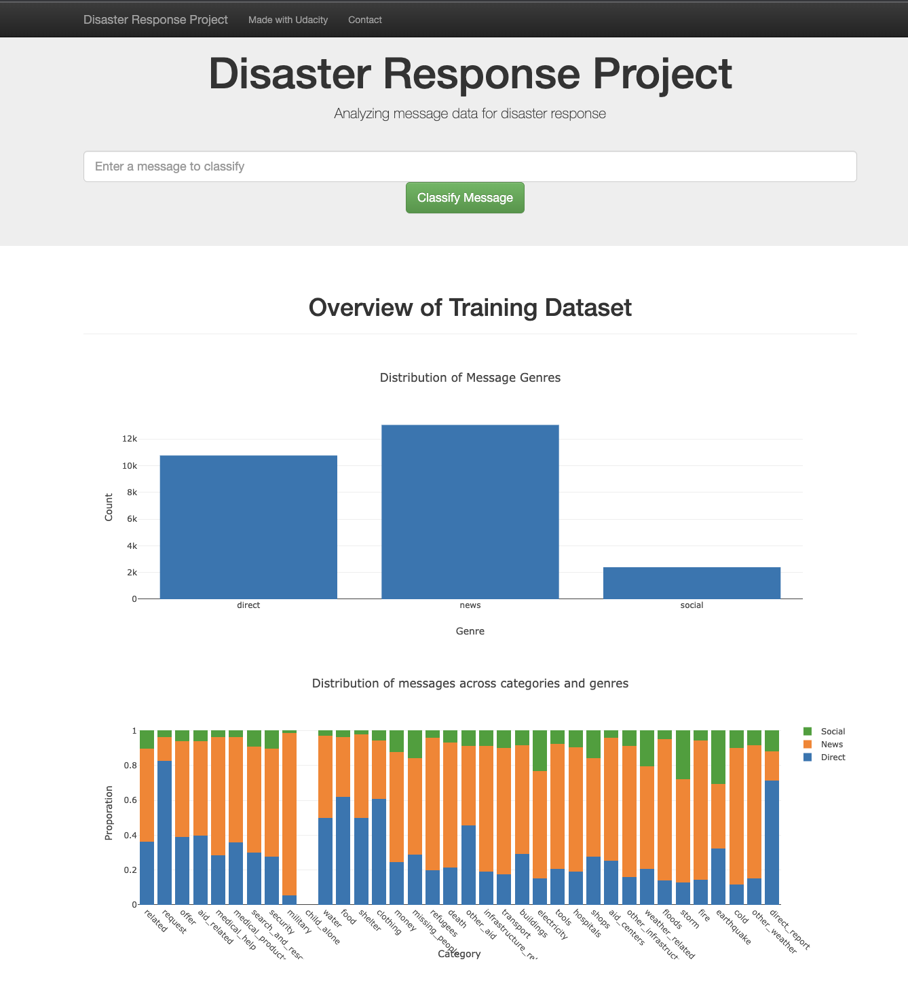
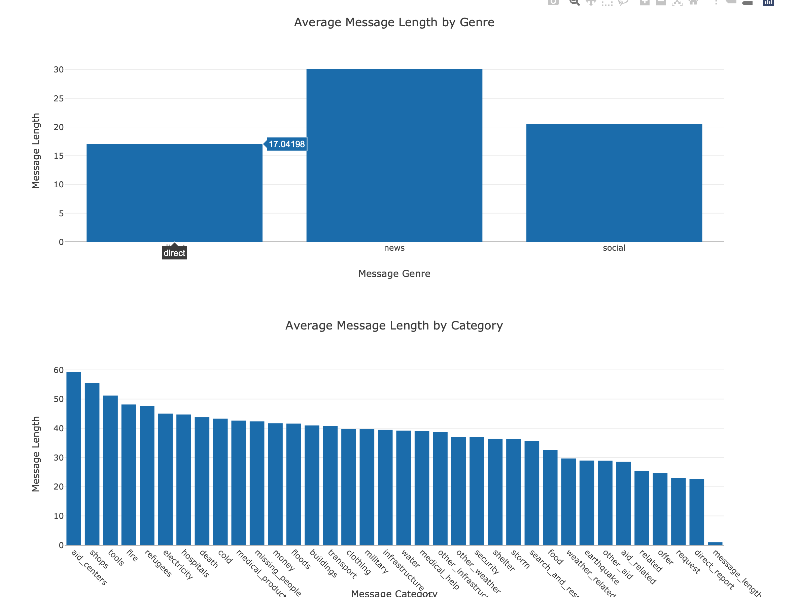
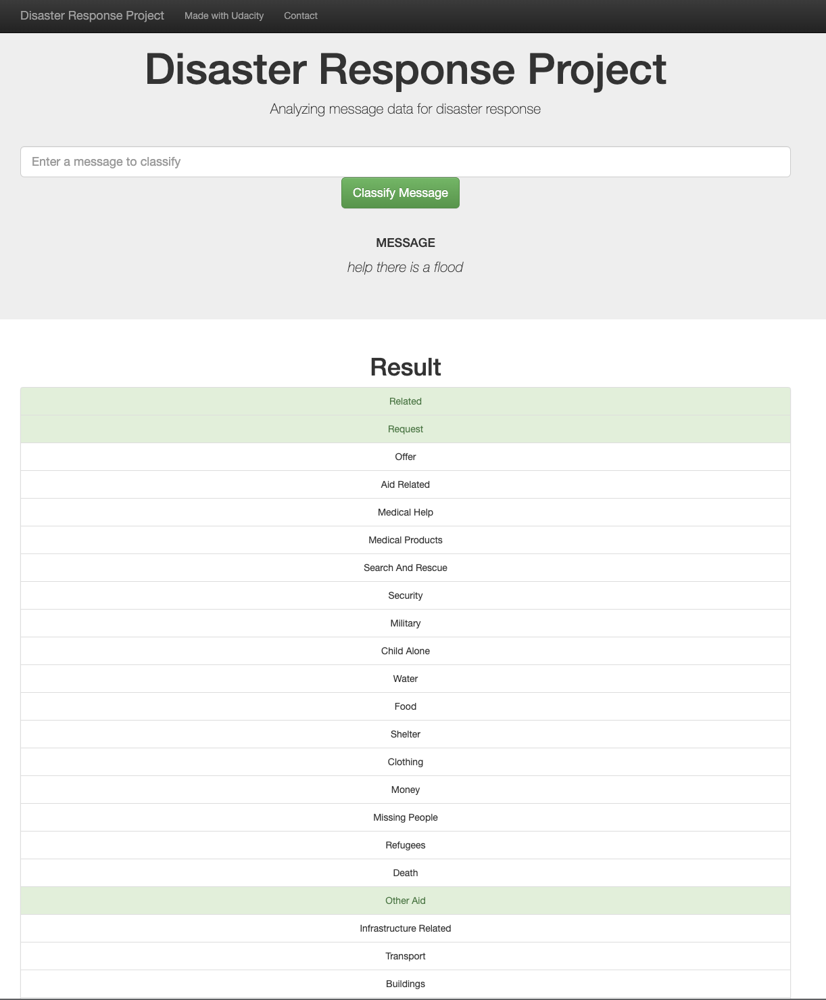
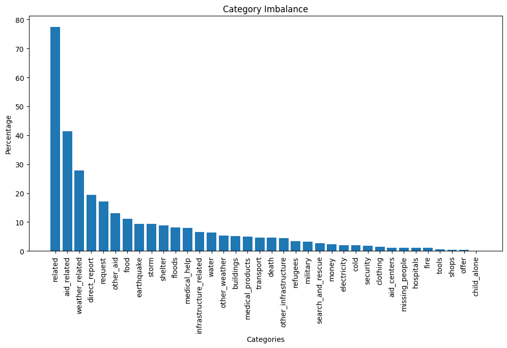

# Disaster Response Pipeline Project

This project aims to build a model for an API that classifies disaster messages based on disaster data from Appen (formally Figure 8). The provided dataset contains real messages that were sent during disaster events. We build a machine learning pipeline to classify possible disaster events. Then, we dispatch the messages to the concerned disaster relief agency.

We provide a web app where an emergency worker can input a new message and get classification results in the pre-defined categories. Furthermore, we provide some visualizations to show the data distribution.


https://github.com/naoufal51/disaster_response/assets/15954923/63695160-ae94-4165-968a-0b93e9e9e035

You can access a live version of the app if you click on the image below:


## Project Components
### 1. ETL Pipeline
ETL in a Python script, `process_data.py`, to prepare the data. The script performs the following tasks:

    - Loads the messages and categories datasets
    - Merges the two datasets
    - Cleans the data
    - Stores the clean data in a SQLite database

### 2. ML Pipeline
ML pipeline in a Python script, `train_classifier.py`, to train and export a classifier. The script performs the following tasks:

    - Loads data from the SQLite database
    - Tokenizes and lemmatizes text data
    - Builds an ML pipeline using `CountVectorizer`, `TfidfTransformer`, and `MultiOutputClassifier`
    - Add features such as `negation_counter`, `verb_counter`, `emotion_counter`, `punctuation_counter`, `text_length`, `capitalization_counter`, `subjectivity`, `polarity`, `ner`.
    - Trains and tunes a model using `GridSearchCV`
    - Outputs results on the test set
    - Exports the final model as a pickle file

### 3. Web App
A Flask web app that shows data visualizations and classifies disaster messages. The web app includes:

    - A data visualization using Plotly in the `go.html` template file
    - A Flask app that runs the web app

## Getting Started
### Dependencies
- Python 3.9
- NumPy
- Pandas
- Scikit-Learn
- NLTK
- Flask
- Plotly
- SQLAlchemy
- SpaCy
- TextBlob
- gunicorn
- contractions

### Installation
- Clone the repository
```bash
git clone https://github.com/naoufal51/disaster_response.git
```
- Create a virtual environment
```bash
python3 -m venv venv
```
- Activate the virtual environment
```sh
source venv/bin/activate
```
- Install the dependencies
```bash
pip install -r requirements.txt
```

## Running the project

### ETL Pipeline
To run the ETL pipeline that cleans data and stores in database, run the following command:
```bash
python data/process_data.py data/disaster_messages.csv data/disaster_categories.csv data/DisasterResponse.db
```
### ML Pipeline
To run the ML pipeline that trains classifier and saves, run the following command:
```bash
python models/train_classifier.py data/DisasterResponse.db models/classifier.pkl
```
### Flask Web App
You can choose to run the app with the model with or without NER (`classifier_light.pkl`). Go to `app/run.py` to make the necessary changes.

To run the Flask web app, run the following command:
```bash
gunicorn app.run:app 
```
Then go to http://127.0.0.1:8000 or http://localhost:8000/

## Web App Screenshots
### Home Page



### Classification Results


## Category Imbalance and Model Performance

This dataset is highly imbalanced as shown in the figure above where a large number of categories have very few samples. This imbalance issue can lead to a biased model that favors the majority classes. This issue is even more critical as we are dealing with disaster response messages where we want to make sure that all categories are well represented. 
### Model Performance
In oder to observe the impact of the imbalance issue, we use the F1 score as a metric to evaluate the model performance. The F1 score is a good metric to assess the balance between precision and recall.


## Acknowledgements
- [Appen](https://appen.com/) for providing the dataset
- [NRC](https://saifmohammad.com/WebPages/NRC-Emotion-Lexicon.htm) for providing NRC Emotion Lexicon. 

